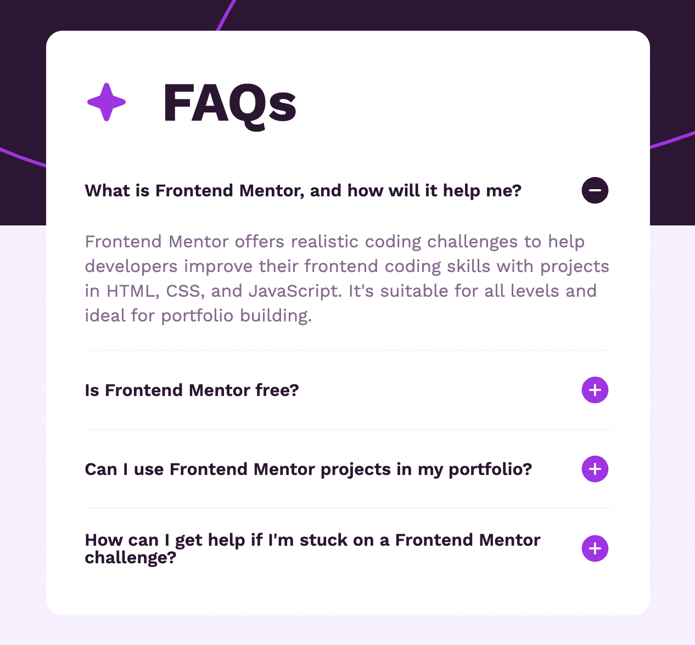

# Frontend Mentor - FAQ accordion solution

This is a solution to the [FAQ accordion challenge on Frontend Mentor](https://www.frontendmentor.io/challenges/faq-accordion-wyfFdeBwBz). Frontend Mentor challenges help you improve your coding skills by building realistic projects.

## Table of contents

- [Overview](#overview)
  - [The challenge](#the-challenge)
  - [Screenshot](#screenshot)
  - [Links](#links)
  - [Built with](#built-with)
- [Author](#author)

## Overview

### The challenge

Users should be able to:

- Hide/Show the answer to a question when the question is clicked
- Navigate the questions and hide/show answers using keyboard navigation alone
- View the optimal layout for the interface depending on their device's screen size
- See hover and focus states for all interactive elements on the page

## Overview

### The challenge

Users should be able to:

- View the optimal layout for the section depending on their device's screen size

### Screenshot

### Links

- Solution URL: [solution](https://www.frontendmentor.io/solutions/faq-accordion-zo6fEdz2yv)
- Live Site URL: [live](https://lackevil.github.io/FAQ-accordion/)

### Built with

- Semantic HTML5 markup + BEM
- SCSS
- Flexbox

## Author

- Website - [Nazar Pasechnyi / Portfolio](https://lackevil.github.io/Portfolio/)
- Frontend Mentor - [@Lackevil](https://www.frontendmentor.io/profile/Lackevil)
